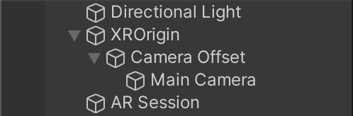
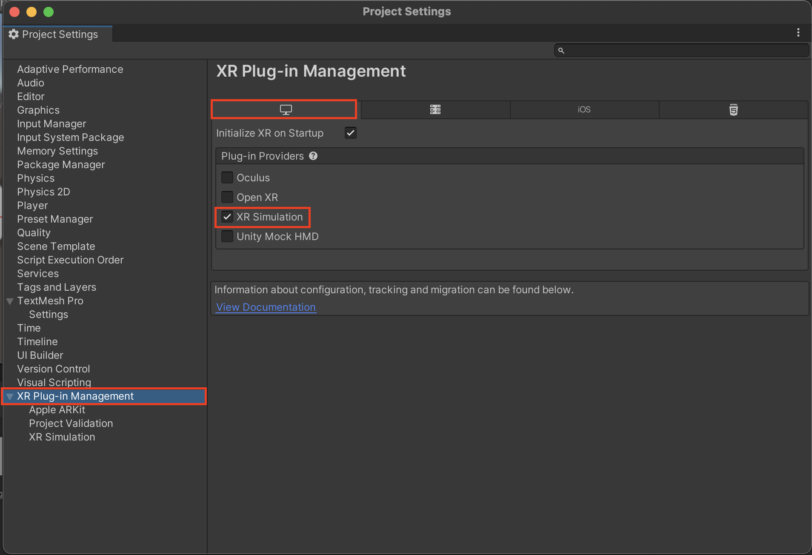

# 1) Setting up AR Foundation Basics

Start by creating a new project using the 3D render pipeline. Once it loads, navigate to the top of the screen to Window > Package Manager to open the package manager window.&#x20;

<figure><figcaption></figcaption></figure>

 - In the top left, click on "Packages: In Project" and change it to "Unity Registry".
 - Use the search bar to the right to search for "AR Foundation" and click install. Once its finished, go back to the scene view.
 - There may be a warning about updating the input system here. If you see the pop-up, click yes and wait for Unity to restart.

Next we're going to build the AR Session and controllers.

- Delete the main camera from the hierarchy on the left. The hierarchy shows what objects are currently active in the scene. We're removeing the camera here because AR Foundation will add it's own later.
- Right click in the hierarchy and click on XR > AR Session. This will create the AR Session object Unity will use to control the device AR input.
- Right click again and go to XR > XR Origin. This will hold the camera that tracks the device.&#x20;

Here's how the hierarchy should look at this point:

<figure><figcaption></figcaption></figure>

- At the top of Unity, go to Edit > Project Settings to open the settings window.
- Click on XR Plug-In Management. This is a drop down menu, but the setting we need is in the top level selection. go to the Windows, Mac, Linux tab (the PC icon), and check the box next to XR Simulation.

<figure><figcaption></figcaption></figure>

&#x20;
To verify everything works, return to the editor and click play.

<figure><figcaption></figcaption></figure>

If you project runs and looks like this, everything is set up! You can use WASD to walk around the environment, and right click and drag the mouse to pan the camera.
