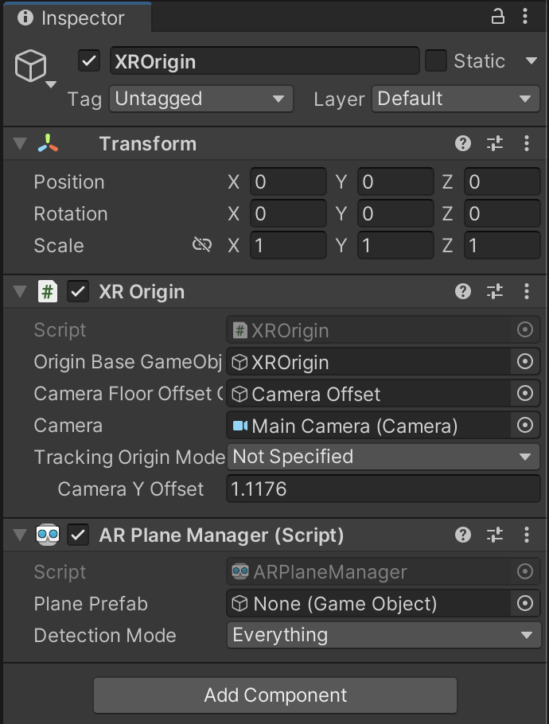
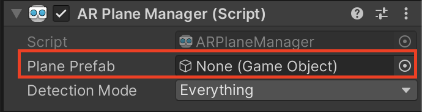

# 2) Surface Detection

For the most part we can use all the defaults AR Foundation gives us, but for the sake of convenience, we will make a few minor changes. 

- Select the XR Origin in the hierarchy.
- To the right of the screen, in the inspector, click on "Add Component" and search for "AR Plane Manager" and click the script to add it to the origin object. The inspector allows you to edit the attributes of specific objects, as well as add components to them.

<figure><figcaption></figcaption></figure>

Now when you press play and walk around, the hierarchy should update the "Trackables" object with planes detected, but you would be unable to see them in the environment.

To fix this, import the plane prefab included in the GitHub and assign it to the "Plane Prefab" field in the plane manager script. 

- Import the prefab by dragging the file to the 'assets' tab at the bottom of the page.
- Drag it into the 'Plane Prefab' portion of the AR Plane Manager

<figure><figcaption></figcaption></figure>

This prefab will allow us to visualize the planes as their detected, gives us a mesh to work with for detecting collisions, and is also tagged as surface, which will allow us to find these objects in code. Running the project now should look something like this:

<figure><figcaption></figcaption></figure>

Those yellow blobs are our surfaces! If everything is working, then this step is finished!
