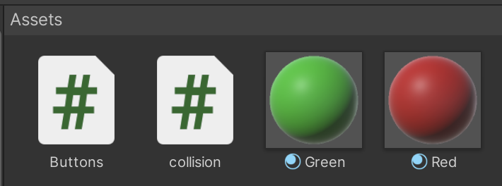
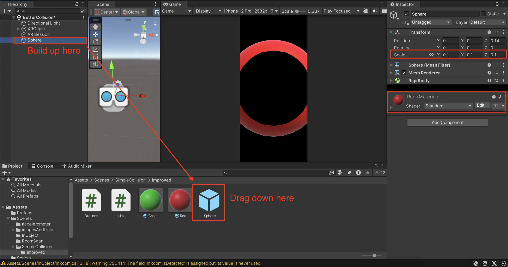
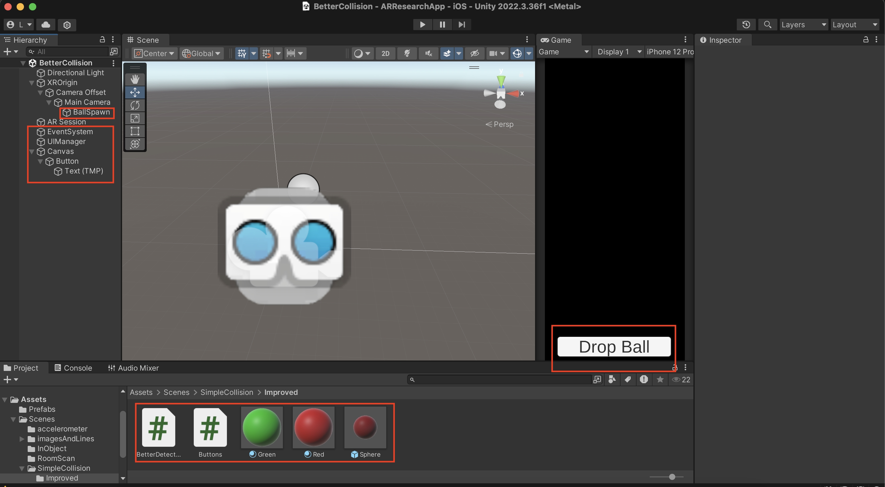
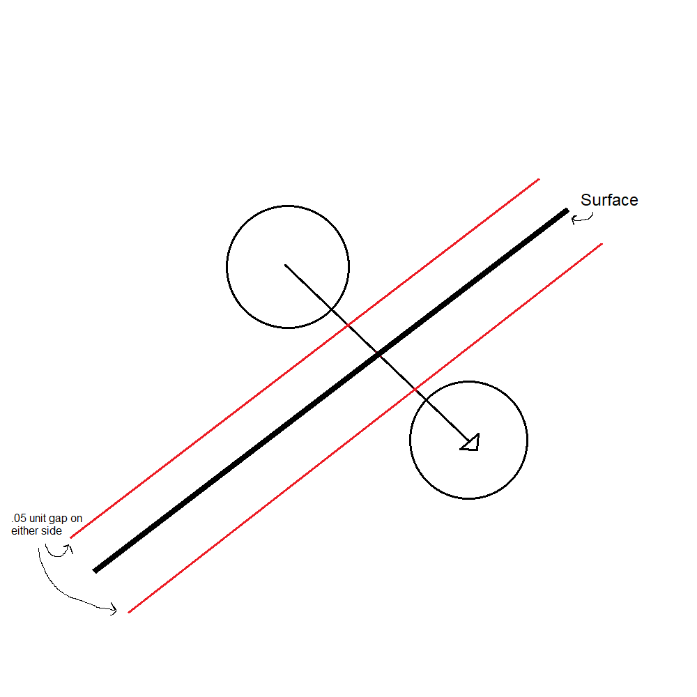

# 3) Collision

Here's where things start to get a little complicated. We need to make a few new objects and paste in some code. 

To start, we need to add 4 objects to the hierarchy, make 2 new scripts, and 2 materials.

First, items in the assets panel:

- Create 2 scripts in the assets. Name one 'collision' and one 'ballButton'

- Next, right click and go to Create > Material. 
- Set the color (albedo) to red. Create another one and make it green. 

<figure><figcaption></figcaption></figure>
<br>

Now, were going to create an object in the hierarchy, then move it to assets in the form of a prefab:

- Right click in the hierarchy and navigate to 3D Object > Sphere. 
- Add the red material to the sphere.
- Set the scale on all axis to .1. 
- Assign the collision script to the sphere by dragging and dropping it into the inspector while the sphere is selected
- Drag the sphere into the assets to make a prefab, then delete the sphere from the hierarchy.

<figure><figcaption></figcaption></figure>
<br>

Finally, some hierarchy objects:

- Right click in the hierarchy and go to UI > "Button - TextMeshPro". This will create the button, canvas, and event system. The canvas will exist in the world space as a large rectangle anchored with it't bottom left corner at the origin. If a window opens asking to import TMP assets, click on import TMP Essensials.
- Position the button and change it's scale to be at the bottom of the screen. You can use the game preview to help position the button.
- Change the button's text (through it's child in the hierarchy) to "Spawn Ball".
<br>

- Right click in the hierarchy and make a new empty object. Name it "uiManager"
<br>

- Find your AR Camera and crate an empty child.
- Set the child's position to 0, 0, .1. This will make it float in front of the camera.
- Change the child's name to "SpawnPoint"
<br>


After everything is added, the project should look something like this (with new additions marked in red):

<figure><figcaption></figcaption></figure>

The sphere prefab is what we will use to allow the user to see the collisions in action. When the ball hits a surface, we'll use the materials to turn it from red to green and freeze it in place. The uiManager object will hold the button script and will make the button spawn a ball when pressed. The collision script with run on each ball when its spawned and enable collision detection.

Moving on to the scripts, open the button script.

- Delete the start and update functions.
- Add 2 serialized fields, one for the spawn point and one for the sphere prefab

```c#
[SerializeField] Transform spawnPoint;
[SerializeField] GameObject ball;
```

- Create a funtion called 'spawnBall'. This is what will be attached to the button to allow it to function

```c#
public void spawnBall(){
        GameObject spawnedBall = Instantiate(ball, spawnPoint.position, Quaternion.identity);
        Rigidbody rb = spawnedBall.GetComponent<Rigidbody>();
        rb.velocity = spawnPoint.forward * 5.0f;
    }
```

The public modifier allows the function to be accessed by the button. The function instantiates the prefab and gives it a small forward velocity, allowing it to hit walls rather than fall straight down.

- Assign the button script to the uiManager object.
- Assign the spawn point and the sphere prefab to their serialize fields in the inspector
- Click on the button. In the inspector assign the uiManager as the referenced object and the spawnBall function as the referenced function.

<figure><figcaption></figcaption></figure>

If you run the scene now, click on the button should cause a ball to appear in front of the camera and be flung forward a little bit.

Now open the collision script.

- Add the following function 'GetClosestPointOnPlane'. This will get the point of the plane that is closest to the ball.

```c#
Vector3 GetClosestPointOnPlane(Vector3 point, Plane infPlane){
        // Find the signed distance from the point to the infinite plane
        float distanceToPlane = infPlane.GetDistanceToPoint(point);

        // Project the point onto the plane by subtracting the normal times the distance
        Vector3 closestPoint = point - infPlane.normal * distanceToPlane;

        return closestPoint;
    }
```

- Add the following function 'isPointInPolygon'. This will take a point and list of vertices of a polygon and determine if the point is within the polygon.

```c#
bool isPointInPolygon(Vector2 point, Vector2[] polygonVertices){
    int intersectionCount = 0;
    int vertexCount = polygonVertices.Length;

    // Loop through all edges of the polygon
    for (int i = 0; i < vertexCount; i++){
        Vector2 v1 = polygonVertices[i];
        Vector2 v2 = polygonVertices[(i + 1) % vertexCount];  // Wrap around to the first vertex

        // Check if the ray crosses the edge
        if ((v1.y > point.y) != (v2.y > point.y) &&
            point.x < (v2.x - v1.x) * (point.y - v1.y) / (v2.y - v1.y) + v1.x)
        {
            intersectionCount++;
        }
    }

        // If the number of intersections is odd, the point is inside the polygon
        return (intersectionCount % 2 == 1);
    }
```

- Add the following function 'ConvertTo2D'. This takes a point and a plane and projects the point from 3D space to the planes space.

```c#
Vector2 ConvertTo2D(Vector3 point, Plane plane)
    {
        // Define local axes for the plane
        Vector3 planeRight, planeForward;

        // If the plane is vertical (close to the y-axis), use x and z for the local 2D axes
        if (Mathf.Abs(plane.normal.y) > 0.9f)
        {
            planeRight = Vector3.right;
            planeForward = Vector3.forward;
        }
        else
        {
            // For non-vertical planes, calculate the local axes using cross products
            planeRight = Vector3.Cross(plane.normal, Vector3.up).normalized;
            planeForward = Vector3.Cross(plane.normal, planeRight).normalized;
        }

        // Project the 3D point onto the plane's local 2D coordinate system
        return new Vector2(Vector3.Dot(point, planeRight), Vector3.Dot(point, planeForward));
    }
```

We will use these functions the the calculations for collisions. We will have the script find all surfaces when the ball is spawned via the start function, then loop though each mesh in the update function to find collisions.

- Add the following variables to the start of the script:

```c#
    private bool surfacesDetected = false;
    private GameObject[] meshObjects;
    private Plane[] planes;
    private Mesh[] meshes;
    private bool collide = false;
    [SerializeField] Material greenMaterial;
```

- Add the following code to the start function:

```c#
//Get all mesh objects currently in scene
        meshObjects = GameObject.FindGameObjectsWithTag("Surface");
        planes = new Plane[meshObjects.Length];
        meshes = new Mesh[meshObjects.Length];

        //For each mesh object, create it's plane and get its mesh    
        for(int i = 0; i < meshObjects.Length; i++){
            planes[i] = new Plane(meshObjects[i].transform.up, meshObjects[i].transform.position);
            meshes[i] = meshObjects[i].GetComponent<MeshFilter>().mesh;
        }

        //Make sure something was actually detected before testing in update
        if (meshObjects.Length > 0){
            surfacesDetected = true;
        }
```

This will get all of the meshes that make up the surfaces, create the associated planes, and verify that surfaces exist in the scene.

- Finally, add the following code to the update function:

```c#
if (surfacesDetected){

            //For each mesh in the scene, get point on the plane closest to the ball and check it's distance to the ball
            for (int i = 0; i < meshes.Length; i++){

                //Convert balls 3D position to point projected on plane
                Vector3 closestPointOnPlane = GetClosestPointOnPlane(transform.position, planes[i]);
                Vector3 closestPointProjected = Vector3.ProjectOnPlane(closestPointOnPlane, planes[i].normal);
                Vector2 closestPoint2D = ConvertTo2D(closestPointProjected, planes[i]);

                //Get distance to plane
                float pointsDistance = planes[i].GetDistanceToPoint(transform.position);

                //If the distance is less than 0.05, we consider the point to be close enough to collide. But we also have to check the mesh bounds
                if (pointsDistance < 0.05f){
                    Vector3[] vertices = meshes[i].vertices;
                    Vector2[] projectedVertices2D = new Vector2[vertices.Length - 1];

                    //Transform vertices to plane
                    for (int j = 0; j < vertices.Length; j++){
                        vertices[j] = meshObjects[i].transform.TransformPoint(vertices[j]);
                        vertices[j] = Vector3.ProjectOnPlane(vertices[j], planes[i].normal);
                    }

                    for (int j = 0; j < vertices.Length - 1; j++){
                        projectedVertices2D[j] = ConvertTo2D(vertices[j], planes[i]);
                    }

                    //Since we know the point is close to the plane, if it's in the mesh its a collision!
                    collide = isPointInPolygon(closestPoint2D, projectedVertices2D);

                }
            }

            if (collide){
                transform.GetComponent<Renderer>().material = greenMaterial;
                Rigidbody rb = GetComponent<Rigidbody>();
                rb.constraints = RigidbodyConstraints.FreezePosition;
            }

        }
```

This works by first verifying that a surface is detected, then loops through each plane to find if there is one that is close enough to cause a collision. If there is, then it checks to see if the ball is within the bounds of the mesh on the plane. If it is, then a collision has occurred and the ball is frozen and turned green.

- Open the sphere prefab and assign the green material to the serialized field.

Now when you run the project, you should be able to hit the button, which will spawn a ball in front of you and turn green and freeze when it hits a surface.

Further research and challenges:

Currently, our solution uses discrete collision detections. At each step forward in time (each loop of the update function), the ball checks to see if it is within .05 units of the surface. If it is, there is a collision, but if not, there is no collision. However, there is a possibility that if the ball has enough velocity, such as due to falling for a long period of time, the ball will be greater than .05 units away from the surface on one side for one step, then further than .05 units away on the other side for the next step.

<figure><figcaption></figcaption></figure>

There are two ways to fix this. One would be to increase the size of the collision bounds. This solution is doomed to fail, however, since if the bound is too big, the ball can collide before it ever touches the surface. If there is no speed limit for moving objects in the physics engine, this solution will also eventually fail for any boundary of size B where the object is moving greater than B*2 units per step. In the end, this allows the ball to pass through the surface without ever counting as a collision.

But we can fix this!

Our surfaces have a front and back side, defined by a vector called its 'normal'. If the normal is facing the ball, it will be a positive distance from the surface, and if the ball is on the other side of the normal, it will be a negative distance. We can add a variable to the ball that keeps track of its last distance. We can then compare the sign of the previous distance to the current one. If the ball is very close to one side of the surface in one step, then very close to the surface on the other side in the next, we can assume that at some point between those two steps the ball had to collide with the surface.

There is also the issue of some balls colliding at .02 units from the surface, and some colliding at -.04 units, causing them to appear staggered on the surface, or embedded in the wall at different depths. This can be fixed by artificially adjusting the ball's position to match the wall's when a collision is detected. You can change the position of an object in Unity by setting transform.position to your desired Vector3.
